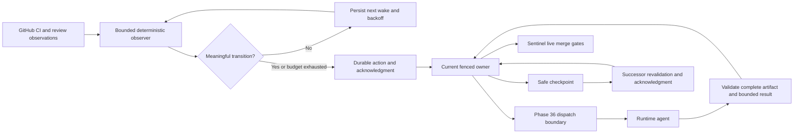

# Phase 33: Reduce orchestration context and transfer sessions safely — Research

**Researched:** 2026-09-16. **Domain:** deterministic orchestration, role artifacts, session recovery. **Confidence:** MEDIUM overall; implementation proposals remain decisions for planning.

## User Constraints

The user limits this pass to research and ticket decomposition: work in this worktree, extend landed code, preserve the accepted dispatch boundary, implement no product code, and introduce no speculative compatibility layer. [VERIFIED: invocation]

No phase CONTEXT was returned by `gsd-tools.cjs query init.phase-op 33` (`"has_context": false`, `"has_plans": false`). The accepted ADR and rollout therefore supply the constraints below; these are not newly inferred user choices. [VERIFIED: init.phase-op 33 output]

<!-- DATA_f37ac429_START -->
> Checkpoint/manual
> resume precedes automatic rotation. Each treatment is evaluated separately;
> Workflow and mandatory quality gates remain. Unsupported automatic transfer
> stays in recommendation mode rather than interrupting a live session.
<!-- DATA_f37ac429_END -->
[VERIFIED: .planning/ROADMAP.md:594-597]

Preserve ADR-011 D3–D5: backoff and compact change/failure/timeout events; durable parking and wake conditions; live gates before mutations; checkpoint identity, scope, evidence and next action; safe acknowledgment; complete findings behind bounded summaries. The packet's initial soft ceiling is **“12k estimated-token”**, calibrated per backend, with overflow references. [VERIFIED: .planning/architecture/ADR-011-measure-the-work-before-optimizing-the-model.md:86-133]

Rollout order is OPT-06 and OPT-07 separately, then OPT-08 checkpoint/manual resume, recommendation, and only proven supported automatic transfer. The initial recommendation seed is a completed phase boundary or the last five ordinary passes exceeding twice the role's prospective startup median; it is not a restart mandate. [VERIFIED: .planning/architecture/ADR-011-ROLLOUT.md:93-132]

## Project Constraints (from AGENTS.md)

The supplied global instructions require Context7 for reference lookups and Shipyard/GSD routing for code work. This invocation is already the mandatory research stage. No worktree-root AGENTS.md or project skill directories were found by the initial read/discovery commands. No extra researcher skills were returned by `query agent-skills gsd-phase-researcher`. [VERIFIED: invocation; initial `cat AGENTS.md`, `rg --files`, and agent-skills command output]

Planner directives from the current generated delivery rules: English artifacts; command-backed claims; complete plan frontmatter and nonempty requirements/file scope; canonical ticket IDs; explicit delivery risk/checkpoint; exact file lists; serialize overlapping ownership; reuse existing implementation; narrow service-free verification; mechanical graph gate; no hand-built graph or invented branches; external-repository ownership must be declared; cross-phase dependencies must already have landed. Preserve preexisting edits to config and generated rules. [VERIFIED: .shipyard/generated/gsd-delivery-rules/SKILL.md, read this session; initial `git status --short`]

The root CLAUDE.md requests broad fast checks on edits, whereas the more specific current delivery rules require scoped ticket verification and leave full-suite execution to CI. Plan scoped checks plus the CI gate; do not silently give every executor the entire suite. Canonical command/reference changes must reach both runtimes through generation, not installed-agent edits. [VERIFIED: CLAUDE.md, Tests and Architecture; .shipyard/generated/gsd-delivery-rules/SKILL.md, planner rule 6 and executor rule 4]

## Summary

Research baseline: `git log -1 --oneline` and `git rev-parse origin/main` both identify **54b87dd3e33d165cfeb4b6fedb8f2c6c323c1b1d**, Phase 36 integration. This is the locally recorded remote-tracking tip; no remote fetch or production mutation was performed. [VERIFIED: git command output]

Reuse the waiter, front, live sentinel gate, existing executor reference contract, authenticated dispatch recorder, and Codex generator. The missing work is durable observation delivery and recovery, uniform validated role artifacts with targeted context, and an acknowledged run-owner protocol. Existing dispatch suppression expires on age or changed evidence; it is not an exclusive session-owner guarantee. [VERIFIED: plugins/delivery-pipeline/scripts/ci-wait.cjs:398-456,554-608; plugins/delivery-pipeline/workflows/executors.mjs:94-145; plugins/delivery-pipeline/scripts/dispatch-record.cjs:1181-1215]

**Primary recommendation:** deliver five vertical tickets in a linear chain, with independently switchable treatments and checkpoint/manual resume as the safe stopping point for automation. The split and proposed new modules below are recommendations, not landed interfaces. [ASSUMED] A1

## Architectural Responsibility Map

Recommended ownership, derived from the accepted layer boundary. [ASSUMED] A1

| Capability | Primary tier | Secondary tier | Responsibility |
|---|---|---|---|
| Observe CI/reviews, backoff, action deduplication | Deterministic local controller | Durable storage; GitHub | Produce recoverable events, no model judgment |
| Decide/fix/review | Runtime-dispatched agent | Controller | Only through the Phase 36 boundary |
| Validate referenced results | Deterministic consumer | Worktree artifact storage | Bind result to dispatch and reviewed revision |
| Target child input | Workflow/typed launch builder | ADR, plan and backlog readers | Retain required scope and policy |
| Checkpoint and owner fencing | Durable controller | Runtime adapter | One dispatch authority, acknowledged takeover |
| Merge | Existing sentinel | Live GitHub | Events/checkpoints never authorize merge |

<phase_requirements>
## Phase Requirements

Descriptions copied verbatim from the source. [VERIFIED: .planning/REQUIREMENTS.md:100-102]

<!-- DATA_7c91bade_START -->
| ID | Description | Research support |
|---|---|---|
| REQ-90 | Unchanged observations do not require repeated model turns; deterministic waiting remains bounded, recoverable and subordinate to live gates. | W1 waiter, action identity, restart and live-gate tests |
| REQ-91 | Role boundaries return bounded summaries and complete referenced evidence; selected backlog and required policy remain available. | W2 artifact consumers and W3 context/measurement |
| REQ-92 | Context rotation transfers durable state with one acknowledged owner, only at a safe boundary and on a supported runtime. | W4 manual handoff; W5 recommendations and capability-gated transfer |
<!-- DATA_7c91bade_END -->
</phase_requirements>

## Standard Stack

Keep the repository's CommonJS Node scripts, Workflow DSL bodies, Bash lifecycle scripts, Git/gh and local JSON records. Use the existing dependency-free harness; no external package installation or package upgrade is proposed. The harness explicitly says **“Dependency-free test harness”** and uses Node assert. [VERIFIED: tests/unit/assert-harness.cjs:3-6; plugins/delivery-pipeline/scripts/lock.cjs:342-376; plugins/delivery-pipeline/scripts/claude-workflow-host.cjs:1-18]

| Tool | Observed version | Use |
|---|---|---|
| Node | v24.10.0 | Local deterministic code and tests |
| Git | 2.50.1 (Apple Git-155) | Worktree/revision evidence |
| gh | 2.87.3 | Live PR/check/review observations |
| Codex CLI | 0.154.0 | Resume capability investigation |
| Claude Code | 2.1.273 | Resume capability investigation |

[VERIFIED: `node --version`, `git --version`, `gh --version`, `codex --version`, `claude --version` output; versions describe this host, not support minimums]

**Package Legitimacy Audit:** not applicable to this proposed no-install scope. Do not add a queue, database, daemon framework or SDK solely for this phase. [ASSUMED] A1

## Current Behavior and Exact Seams

Evidence locators below identify the source read with numbered `nl -ba` ranges during this session. They are not proposed new storage paths.

### OPT-06: deterministic waiting

* **Existing:** the waiter guards against actionable work and outstanding agents, deduplicates parent/child watches by repository/PR, treats unreadable check responses separately, persists empty-window counts, and escalates after a bounded budget. The poll interval is fixed: **`const INTERVAL_S = flag('--interval', 30);`**; the loop calls **`sleep(Math.min(INTERVAL_S, Math.max(1, (deadline - Date.now()) / 1000)));`**. [VERIFIED: plugins/delivery-pipeline/scripts/ci-wait.cjs:126,192-353,398-481,607]
* **Persistent writer:** **`const WAITS = path.join(GRAPH, 'ci-waits.json');`**, published by **`writeAtomic(WAITS, JSON.stringify(store, null, 2) + '\n');`**. These records retain stall budgets, not a acknowledged event inbox. The watcher and deadline are reconstructed in-process each invocation. [VERIFIED: plugins/delivery-pipeline/scripts/ci-wait.cjs:364,426-456,516-568]
* **Actual caller:** delivery's loop-back calls the waiter, then instructs the model to resync on settlement or timeout. Its foreground behavior is intentional; replacing it with an unattached background process would lose the current wake guarantee. [VERIFIED: plugins/delivery-pipeline/commands/deliver.md:2122-2146]
* **Live authority:** sentinel's merge path rereads PR/check data, matches the architecture verdict to the live head, and refuses unreadable checks. Keep it intact. [VERIFIED: plugins/delivery-pipeline/scripts/sentinel.cjs:810-825,920-950]
* **Snapshot race:** state-sync writes state/front then publishes metadata last. The front's generation is advisory and can be dropped by dispatch overlay refresh; use the metadata publisher as the snapshot consistency seam, not front timestamps as a durable cursor. [VERIFIED: plugins/delivery-pipeline/scripts/state-sync.cjs:1039-1072]
* **Gap/recommendation:** add bounded backoff, review observation, durable next-wake/action identity and acknowledgment around these seams. Replay must redeliver an unacknowledged event safely without causing another logical work request. Do not promise exactly-once external mutation from JSON logging alone. [ASSUMED] A2

### OPT-07: bounded artifacts and child inputs

* **Executor already bounded:** the result schema says **`status: { enum: ['committed', 'blocked'] }`**, **`maxLength: 500`**; normalization independently caps text and computes paths. Producer instructions write to **`${t.worktreePath}/.shipyard-pr-body.md`** and **`${t.worktreePath}/.shipyard-evidence.md`**. Preserve these existing outputs while adding validated metadata. [VERIFIED: plugins/delivery-pipeline/workflows/executors.mjs:94-145,218-249]
* **Consumer gap:** delivery mechanically checks commits/scope, then reads those returned files and publishes. The inspected result normalizer and publishing instructions do not bind artifact content to dispatch or revision. Add validation before either evidence acceptance or publication; merely generating a hash in the agent is insufficient. [VERIFIED: plugins/delivery-pipeline/workflows/executors.mjs:133-145; plugins/delivery-pipeline/commands/deliver.md:1618-1640]
* **Other result surfaces:** fix-round carries **`status: { enum: ['fixed', 'no-op', 'escalate'] }`** plus uncapped notes/hypothesis. Drift carries **`verdict: { enum: ['fresh', 'drifted'] }`** plus uncapped arrays. Both strip an agent-supplied receipt before attaching boundary provenance. Preserve that distinction. [VERIFIED: plugins/delivery-pipeline/workflows/fix-round.mjs:73-97,274-276; plugins/delivery-pipeline/workflows/drift-gate.mjs:59-94,199-204]
* **Judgment roles:** arch-review requires every violating ADR/hunk and an exact merge-base tree for conformance; integrator writes a complete integration artifact. A bounded envelope must preserve all blocking findings in a referenced artifact, never cap the finding set. [VERIFIED: plugins/delivery-pipeline/references/arch-review.md:15-66; plugins/delivery-pipeline/references/integrator.md:24-44]
* **Backlog prerequisite gap:** the index provides source hashes, stale verification, excerpts and bounded queries, but `rg -n 'backlog-index' plugins/delivery-pipeline scripts tests/unit/backlog-index.test.cjs` found only its implementation/tests, not a delivery-command caller. Do not infer full OPT-02 caller integration from the checked requirement box. Wire selection into the real child context builder. [VERIFIED: plugins/delivery-pipeline/scripts/backlog-index.cjs:69-105; scoped search output]
* **Measurement seam:** attribution is metadata-only, correlates dispatch with transcript identity, and separates **`new Set(['ordinary', 'advisor'])`**. Its field allowlist has no startup/re-ingestion measurement fields. Extend the collector deliberately or join a separate versioned measurement stream; do not stuff prompt text or extra fields into the existing ledger. [VERIFIED: plugins/delivery-pipeline/scripts/usage-attribution.cjs:4-17,26-48]

### OPT-08 and the Phase 36 boundary

* **Mandatory launch order:** the boundary validates, reserves dispatch identity, invokes the adapter, verifies application evidence, records durably, and returns a finalized receipt. A successful launch followed by recording failure is an ambiguous external side effect; recovery must reconcile it, not blindly dispatch again. [VERIFIED: plugins/delivery-pipeline/scripts/dispatch-boundary.cjs:2030-2165]
* **Not session ownership:** the existing repair claim is tied to a predecessor dispatch receipt. Dispatch marks also expire by TTL or changed fingerprint. Neither inspected seam supplies a checkpoint acknowledgment for the whole orchestrator. Plan explicit owner fencing without weakening existing receipt claims. [VERIFIED: plugins/delivery-pipeline/scripts/dispatch-boundary.cjs:2053-2060,2133-2136; plugins/delivery-pipeline/scripts/dispatch-record.cjs:1190-1215]
* **Runtime boundary:** Workflow host callbacks, recorder, capabilities and application evidence stay in host closures, outside serializable args. Codex refuses inherited/inline or contradictory selection and passes static roles immutable validated generated bytes. A context manifest or successor cannot become launch authority. [VERIFIED: plugins/delivery-pipeline/scripts/claude-workflow-host.cjs:1-18,41-67; plugins/delivery-pipeline/scripts/codex-dispatch-adapter.cjs:248-306]
* **Generated delivery:** generator copies canonical scripts/references/templates/workflows, hashes generated payloads and registrations, validates the staged bundle, then swaps it in. Exact write: **`writeFile(path.join(stageDir, 'manifest.json'), JSON.stringify(manifest, null, 2) + '\n');`**. Extend canonical sources and test generated consumers; never patch installed agents. [VERIFIED: scripts/gen-codex-shipyard.cjs:287-358]
* **Resume is not proven transfer:** installed help exposes Codex **`codex resume [OPTIONS] [SESSION_ID] [PROMPT]`** and Claude **`--resume`**, **`--fork-session`**. Help inspection performed no successor launch. Claude documentation says resume appends to existing history and fork copies history into another session, so neither alone demonstrates reduced startup context. [VERIFIED: installed CLI help output] [CITED: https://code.claude.com/docs/en/how-claude-code-works]

## Architecture Patterns

Proposed flow; the owner and acknowledgment components are new work, not an existing API. [ASSUMED] A2–A4



Use one versioned action identity bound to run/ticket/repository/PR/head and the meaningful observation, with durable pending delivery and consumer acknowledgment. Exclude timestamps and incidental response ordering from semantic equality. Persist backoff/deadline state; inject time and observation I/O for deterministic replay. Recheck newly actionable work while waiting. Unknown observation is neither unchanged evidence nor success. [ASSUMED] A2

Use one role envelope with outcome, actionable delta, capped summary, complete evidence references/digests and blocking count. Bind each artifact to producer dispatch, ticket/role, repository/worktree, applicable head/base, policy and schema revision. Validate at the consuming boundary, including missing/truncated content, symlink/path escape, wrong dispatch and changed revision; cap only the envelope. The exact schema and byte limits need plan-time definition. [ASSUMED] A3

Checkpoint/manual resume should use a durable owner epoch or equivalent fencing token. A successor first reads and validates the checkpoint, reconciles live state and active children, then acknowledges under the same ownership authority used before launch. Losing ownership must fence a previously paused predecessor, including one returning after timeout. Preserve ambiguous launches for reconciliation. Do not equate expired bookkeeping with proof that a child stopped. [ASSUMED] A4

## Proposed Work Packages and Order

The following provisional ticket IDs and new file names are proposed scope, not existing contracts. List tests explicitly in each final PLAN and run the graph validator. [ASSUMED] A1

| Ticket | Deliverable and exact principal seams | Acceptance/dependency |
|---|---|---|
| T-33-01 | **Durable observation-to-action loop.** Extend `plugins/delivery-pipeline/scripts/ci-wait.cjs`, `front.cjs`, `state-sync.cjs`, `sentinel.cjs`, `stop-gate.cjs`, `commands/deliver.md`, `references/pr-sentinel.md`; proposed sibling `orchestration-events.cjs`; existing wait/front/sentinel/stop tests plus new restart/event tests. | REQ-90. Real command caller consumes compact events. No repeated model work for unchanged observations; restart replay, outage and review-only changes tested; live merge refusal retained. Root ticket. |
| T-33-02 | **Bounded role artifacts through real consumers.** Proposed `scripts/role-artifacts.cjs`; extend workflows `executors.mjs`, `fix-round.mjs`, `drift-gate.mjs`, `investigation-research.mjs`; references `inv-research.md`, `drift-check.md`, `ci-fix.md`, `review-fix.md`, `arch-review.md`, `pr-sentinel.md`, `integrator.md`; commands `investigate.md`, `decompose.md`, `deliver.md`; `scripts/gen-codex-shipyard.cjs` and workflow/generator tests. | REQ-91. Include researcher and planner typed callbacks, executor, both fixers and all judgment roles. Existing executor paths survive. Missing/stale results cannot publish or clear gates; overflow findings remain reachable. Depends T-33-01 for shared command/sentinel files. |
| T-33-03 | **Targeted child context and measured treatments.** Proposed `scripts/role-context.cjs`; extend context builders in the four workflows, typed launch callers in the three commands, `scripts/backlog-index.cjs`, `usage-attribution.cjs`, `usage-report.cjs`, generator and corresponding tests. | REQ-90/91. Required ADR/plan/scope and selected backlog reach real children; measure startup, subsequent history and parent result reads separately. Baseline and OPT-06/07 arms remain separate. Depends T-33-02. |
| T-33-04 | **Durable checkpoint/manual resume and exclusive dispatch ownership.** Proposed `scripts/session-checkpoint.cjs`; extend `dispatch-boundary.cjs`, `dispatch-record.cjs`, `commands/deliver.md`, `references/pr-sentinel.md`, and host launch seams as necessary; generator/installer projections and focused recovery tests. | REQ-92. Crash-before-write, crash-before-ack, double resume, launch ambiguity, changed head, dirty work and active child all tested; exactly one owner may dispatch. Depends T-33-03. Ship this before automation. |
| T-33-05 | **Rotation recommendation and proven supported transfer.** Extend checkpoint controller, `runtime-context.cjs`, the actual Claude/Codex adapter selected by the capability probe, delivery entry/generator and focused runtime smoke tests; document proving-ground evidence. | REQ-92. Use measured recommendation seeds; capability absence/uncertainty stays checkpoint/recommendation mode. Add automatic launch only with host-specific positive proof and acknowledgment tests. Depends T-33-04. |

All unqualified scripts/references/commands above are under `plugins/delivery-pipeline/`; the generator alone is repository-root `scripts/gen-codex-shipyard.cjs`. These are edit targets, not a request to create all named files. Plan exact test filenames and installer edits after checking the consuming seam. No wildcard `files_modified`. [ASSUMED] A1

Why five: split artifacts from input selection/measurement and manual recovery from automation, but keep each producer with its actual consumer and generator tests. Shared command, workflow, journal and boundary surfaces make a linear chain the smallest honest collision-free sequence. Phase 32's conceptual prerequisites are baseline inventory/routing/reviewer contracts, not cross-phase PLAN dependencies to invent; confirm their consumer coverage, especially the backlog gap. [ASSUMED] A1 [VERIFIED: .planning/architecture/ADR-011-ROLLOUT.md:24-37,95-119]

## Don't Hand-Roll

| Problem | Extend instead | Constraint |
|---|---|---|
| CI/review classification and merge authority | Existing check classification, front and sentinel | Cached events cannot replace live gates |
| Runtime model/effort or receipt verification | Phase 36 dispatch boundary and adapters | No compatibility palette, inherited session launch or fabricated receipt |
| Executor output | Existing two files and capped envelope | Add revision validation; do not re-inline evidence |
| Backlog lookup | Existing source-hash inventory | Wire a caller; excerpts are not full policy |
| Generated skills/agents | Canonical references and generator | Test staged generated bytes |

[VERIFIED: implementation seams above; .planning/architecture/ADR-014-mandatory-runtime-model-ladder.md:28-34; ADR-011 D3–D5]

## Common Pitfalls

1. **Suppressing delivery before acknowledgment:** crash loses the transition. Persist first, replay safely and deduplicate at consumption. [ASSUMED] A2
2. **Overclaiming durability:** existing `writeAtomic` uses **`fs.writeFileSync(tmp, data);`** then **`fs.renameSync(tmp, file);`**. This proves atomic replacement intent, not a power-loss guarantee; specify process-crash recovery separately and reuse the boundary's stronger reservation patterns where required. [VERIFIED: plugins/delivery-pipeline/scripts/lock.cjs:360-373] [ASSUMED] A4
3. **Confusing provenance with ownership:** a valid role application receipt does not acknowledge successor ownership. Check both before dispatch; never revive an acknowledged predecessor during rollback. [VERIFIED: .planning/architecture/ADR-011-measure-the-work-before-optimizing-the-model.md:114-120,215-220; dispatch boundary evidence above]
4. **Unbounded content hidden behind a short reply:** parent reads of full evidence can erase output savings. Measure actual re-ingestion and retain targeted reads without hiding blockers. [ASSUMED] A3
5. **Counting elapsed waits as model turns:** observe model responses and tool calls separately, retain failed/interrupted runs, cache categories and handoff costs; do not claim quota savings without provider/account attribution. [VERIFIED: .planning/architecture/ADR-011-ROLLOUT.md:187-223]

## Code Examples

Existing executor pattern, verbatim; these are current values, not a proposed new schema. [VERIFIED: plugins/delivery-pipeline/workflows/executors.mjs:112-124]

<!-- DATA_691ab2ef_START -->
```javascript
const docPaths = (t) => ({
  prBodyPath: `${t.worktreePath}/.shipyard-pr-body.md`,
  evidencePath: `${t.worktreePath}/.shipyard-evidence.md`,
})
const cap = (s, n = 500) => {
  const str = typeof s === 'string' ? s : ''
  return str.length > n ? `${str.slice(0, n - 1)}…` : str
}
```
<!-- DATA_691ab2ef_END -->

Apply result validation around this pattern; do not mistake deterministic paths for validated contents. [ASSUMED] A3

## Runtime State Inventory

This changes orchestration state rather than renaming a product. Inventory is deliberately scoped; no production secrets, scheduler inventory or live GitHub mutations were inspected. [VERIFIED: research command scope]

| Category | Observation | Required plan action |
|---|---|---|
| Stored data | Existing wait records, dispatch records/receipts, graph snapshots and usage attribution are read/written by the seams above. [VERIFIED: cited writer reads] | Define new-record bootstrap and restart handling; preserve history; do not bulk rewrite old receipt provenance. [ASSUMED] A4 |
| Live service configuration | GitHub is the live source used by merge and sync; current external settings were not queried. [VERIFIED: sentinel source reads] | Proving-ground check must use actual repository review/CI policy; no configuration migration proposed. [ASSUMED] A4 |
| OS-registered state | Scheduler/background launcher registrations were not audited. [ASSUMED] A5 | Do not assume a daemon can wake the session; verify the chosen host mechanism before auto-transfer. |
| Secrets/environment | No secret values inspected. Runtime capability evidence is host-injected. [VERIFIED: claude-workflow-host.cjs:35-67; command scope] | Store identities/references, not credentials, in checkpoints; do not edit global host settings. [ASSUMED] A4 |
| Installed/build artifacts | Generator stages and validates canonical payloads before swap; offline tests exercise a throwaway home. [VERIFIED: scripts/gen-codex-shipyard.cjs:287-358; tests/unit/gen-codex-shipyard.test.cjs:3-6,51-65] | Regenerate through installer; test stale/tampered manifest refusals. Never hand-edit an installed agent. |

## Environment Availability

Node/Git/gh and both CLIs are available at the versions above. Context7 MCP was callable. The installed GSD init/research-plan/confidence/store commands ran successfully; graph context was unavailable at the expected graph location. External runtime callbacks, active child enumeration, fresh-session launch and acknowledgment were **not exercised**. CLI presence is not capability proof. [VERIFIED: tool and command outputs]

No missing dependency blocks planning or offline implementation. Automatic transfer remains gated on a positive host probe; its fallback is checkpoint/manual resume and recommendation, as already authorized by the roadmap. [VERIFIED: .planning/ROADMAP.md:594-597]

## Validation Architecture

Enabled configuration: **`"nyquist_validation": true`**. Use the repository's Node assert harness, no framework install. [VERIFIED: .planning/config.json:20-24; tests/unit/assert-harness.cjs:3-6]

| Requirement | Focused existing commands | Required new coverage |
|---|---|---|
| REQ-90 | `node tests/unit/ci-wait.test.cjs`; `node tests/unit/front.test.cjs`; `node tests/unit/sentinel.test.cjs`; `node tests/unit/stop-gate.test.cjs` | Fake-time backoff, unchanged CI/review replay, reordered responses, partial outage, crash between publish/consume/ack, concurrent observers, actionable work during wait, live merge changed-head refusal |
| REQ-91 | `node tests/unit/workflows-args.test.cjs`; `node tests/unit/backlog-index.test.cjs`; `node tests/unit/gen-codex-shipyard.test.cjs`; `node tests/unit/usage-attribution.test.cjs` | Every role's real producer/consumer, lost/duplicate results, complete overflow blockers, wrong hash/revision/dispatch, missing file, path/symlink escape, child-required-context assertions, separate overhead counters |
| REQ-92 | `node tests/unit/dispatch-boundary.test.cjs`; `node tests/unit/dispatch-record.test.cjs`; `node tests/unit/claude-workflow-host.test.cjs`; `node tests/unit/codex-dispatch-adapter.test.cjs` | Process failure injection, competing successors, late predecessor, failed launch/ack, receipt reconciliation after restart, dirty work/active child refusal, fresh live-state revalidation |

Commands are existing test entry points; proposed scenarios are acceptance additions, not claims of current coverage. [VERIFIED: test-file discovery and inspected test sources] [ASSUMED] A1–A4

**Executed this research:** workflow args, cold-start contract and dispatch-boundary tests completed in one successful command chain; boundary reported **60 passed, 0 failed**. CI-wait reported **45 passed, 0 failed**; generator/offline installer reported **89 passed, 0 failed**. The generator suite stubs the GSD converter; this is not an official-converter or live-transfer proof. [VERIFIED: test command output; tests/unit/gen-codex-shipyard.test.cjs:3-6,29]

**Wave 0:** add focused event/artifact/checkpoint test entry points with injected clock/I/O and multi-process fixtures. Target under 30 seconds for new quick slices; the current wait and installer suites took longer and must not be mislabeled sub-30-second checks. Per commit run touched slices, per integration run the relevant matrix; CI owns the full fast suite. Require generated-runtime smoke and the real clean-phase handoff at the phase gate; a synthetic host alone cannot close automatic transfer. [ASSUMED] A1–A4 [VERIFIED: .planning/architecture/ADR-011-ROLLOUT.md:119-123]

## Security Domain

Security enforcement is enabled: **`"security_enforcement": true`**, **`"security_asvs_level": 1`**. [VERIFIED: .planning/config.json:47-48]

Use ASVS **5.0** category identifiers, not the older template numbering: V2 Validation and Business Logic, V6 Authentication, V7 Session Management, V8 Authorization, V11 Cryptography. These are reference categories; this CLI phase is not a web-app compliance certification. [CITED: https://cornucopia.owasp.org/taxonomy/asvs-5.0]

| Category | Applicability and proposed control |
|---|---|
| V2 | Validate artifact/checkpoint schema, byte bounds, path containment, revision and digest |
| V6 | Retain runtime/GitHub authentication; do not add credentials to stored packets |
| V7 | Apply lifecycle ideas to run ownership; no browser-cookie mechanism needed |
| V8 | Fence dispatch and acknowledgment; reject stale owners and forged callback evidence |
| V11 | Use existing authenticated receipt machinery and Node primitives; a content hash alone is not authorization |

Applicability/control mapping is a proposal. Principal threats are forged artifacts/receipts (tampering), stale-owner dispatch (privilege misuse), checkpoint secret leakage (disclosure), and unbounded waits/results (denial of service). Test these at the actual consumer and launch boundary. [ASSUMED] A4

## State of the Art

The accepted Phase 36 contract supersedes old model-selection guidance: **“Supersedes: ADR-005 and ADR-012 where they define model/effort selection”**. Phase 33 preserves native runtime grids and mandatory application evidence; it must not restore legacy fallback behavior while reducing context. [VERIFIED: .planning/architecture/ADR-014-mandatory-runtime-model-ladder.md:3-7,28-34]

## Open Questions (RESOLVED)

Planning disposition on 2026-09-16 resolves the implementation choices below; it does not convert uncollected runtime or economic evidence into proven capability. Historical five-ticket proposals above remain research history; the nine canonical PLANs own execution.

| ID | Resolution | Executable owner |
|---|---|---|
| A1 | RESOLVED: nine serial vertical tickets; exact new helpers/test paths, no new dependencies; generator copy contract reused | CONTEXT.md; 33-01 through 33-09 |
| A2 | RESOLVED: semantic digest plus transition sequence, durable pending/ack, dispatch identity reconciliation, publisher binding, bounded live refresh | 33-01 tasks 1–3 |
| A3 | RESOLVED: 500-character/8192-byte envelope; complete evidence index; 12000 soft estimated-token ceiling, ceil(UTF-8 bytes/4); separate startup and consumption counters | 33-02 tasks 1–2; 33-03 through 33-07 |
| A4 | RESOLVED: Git-common-directory owner store, scope index, host-held epoch, atomic ack and in-flight reservation; process-crash recovery, no power-loss claim; active references pinned without automatic deletion | 33-08 tasks 1–3 |
| A5 | RESOLVED disposition: automatic transfer remains unproven and hard-refused; manual handoff must pass the actual runtime/proving-ground gate. No speculative adapter or invented child-enumeration API | 33-08 task 3; 33-09 tasks 2–3 |

Additional explicit unknowns: no prospective startup median or quota gain was established; no live transfer was attempted; live service/OS registrations were not audited. Artifact retention duration and a minimum cohort for default promotion must not be invented here. Use the accepted rollout evaluation protocol and record inconclusive evidence honestly. [VERIFIED: research scope; .planning/architecture/ADR-011-ROLLOUT.md:187-223]

## Sources and Metadata

Primary internal evidence is the numbered source ranges above, inspected with `nl -ba <file> | sed -n '<range>p'`, plus direct `cat` reads of project guidance. Search located seams; source reads, not search hits alone, support discrete contract quotations. `git status --short`, init, CLI help and the named test commands provide reproduction steps. No dedicated Read/Write tools were exposed; filesystem reads used the shell and this artifact was written through the available patch tool. [VERIFIED: tool invocation record]

External lookup used the GSD research-plan seam, Context7 `/websites/code_claude`, and official OWASP search results; digests were cached. `query classify-confidence --provider context7 --verified` and `--provider websearch --verified` both returned **MEDIUM**. External claims retain citation tags; host transfer capability remains unproven. [VERIFIED: research seam output]

* [Claude session semantics](https://code.claude.com/docs/en/how-claude-code-works) — resume/fork history behavior. [CITED: code.claude.com/docs/en/how-claude-code-works]
* [OWASP ASVS 5.0 taxonomy](https://cornucopia.owasp.org/taxonomy/asvs-5.0) — category mapping. [CITED: cornucopia.owasp.org/taxonomy/asvs-5.0]

**Confidence:** existing-code findings are directly evidenced; architecture/decomposition and new contracts remain explicit assumptions; automatic transfer is unproven. Recheck source citations after any changes to the baseline; re-probe runtime support before planning automatic launch. [ASSUMED] A1–A5
