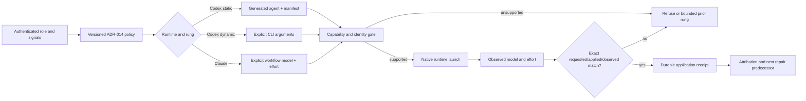

# Phase 46: Refresh the native runtime model ladder — Research

**Researched:** 2026-09-30
**Domain:** Versioned native model routing, application evidence, generated installation
**Confidence:** HIGH for repository architecture and locked scope; MEDIUM for vendor CLI capabilities; live account application unverified

<user_constraints>
## User Constraints (from CONTEXT.md)

The following is copied verbatim from `CONTEXT.md` (`nl -ba .planning/phases/46-refresh-native-runtime-model-ladder/CONTEXT.md | sed -n '17,83p'`). The target values are accepted decisions, not observations of a live host. [VERIFIED: .planning/phases/46-refresh-native-runtime-model-ladder/CONTEXT.md:17-83]

### Locked Decisions

DATA_d9fb8d42_START
- **P46-A — Codex native ladder:** pin Sol to `gpt-6.1-sol`; use Sol/low for ordinary execution, initial ci-fix/review-fix and drift-check. Retain Sol/high and Sol/xhigh judgments and receipt-backed repair escalation. Keep Luna/medium sentinel unchanged and Astra outside the ordinary routed grid.
- **P46-B — Claude native ladder:** pin Sonnet to `claude-sonnet-5-5` and retain `claude-opus-5-5`; adopt the exact role matrix below, proving native model and effort compatibility. Preserve existing declared critical/checkpoint and judgment signals, conservative unknown checkpoint treatment, and the existing Fable window rule until a separately accepted amendment.
- **P46-C — Application and evidence integrity:** migrate canonical policy, runtime adapters, generated role sources/outputs, capability checks and requested/applied/observed verification together under a new policy version/fingerprint. Preserve authenticated repair predecessor checks, fail closed on unsupported or mismatched selections, and preserve historical receipt/control bytes and ownership of in-flight old-policy runs.
- **P46-D — Reviewable installation and rollback:** update supported install/provenance documentation and checks with the native ladder. Validate installation in an isolated runtime home; do not mutate another active runtime or controller. Rollback restores the prior reviewed package/policy while preserving evidence; outer coordination activation remains with the existing ADR-023 D6 owner seam.
- **P46-E — Scoped regression and honest outcomes:** verify the exact role grid, generation, native application, negative mismatches, repair progression and historical evidence compatibility through focused tests and independent review. Adopt the operator-authorized policy migration separately from long-term economy experiments; do not add duplicate experiment infrastructure or claim a measured quota saving.
DATA_d9fb8d42_END

### the agent's Discretion

No `the agent's Discretion` section appears in `CONTEXT.md`. Implementation slicing is constrained by the locked decisions and scope fence. [VERIFIED: .planning/phases/46-refresh-native-runtime-model-ladder/CONTEXT.md:1-91]

### Locked role matrix

DATA_c0de805e_START
#### Codex

Sol means `gpt-6.1-sol`; Luna means `gpt-6-luna`.

| Role | Base | Escalation |
|---|---|---|
| research | Sol/high | Sol/xhigh for explicit very-complex |
| decomposition | Sol/high | Sol/xhigh for critical/checkpoint |
| executor | Sol/low | Sol/high for critical/checkpoint |
| arch-review | Sol/high | Sol/xhigh on existing judgment signals |
| integrator | Sol/high | Sol/xhigh on existing judgment signals |
| ci-fix / review-fix | Sol/low | Verified repeat → Sol/high; verified repeat_exhausted → Sol/xhigh |
| pr-sentinel | Luna/medium | No automatic tier promotion |
| drift-check | Sol/low | No automatic tier promotion |

#### Claude

Sonnet means `claude-sonnet-5-5`; Opus means `claude-opus-5-5`.

| Role | Base | Escalation |
|---|---|---|
| research | Sonnet/xhigh | Opus/high for explicit very-complex |
| decomposition | Sonnet/xhigh | Opus/high for critical/checkpoint |
| executor | Sonnet/medium | Sonnet/xhigh for existing critical/checkpoint signals; additional failure-driven promotions are deferred |
| arch-review | Sonnet/xhigh | Opus/high for contested/critical; preserve existing Fable window rule |
| integrator | Sonnet/xhigh | Opus/high for contested/critical |
| ci-fix / review-fix | Sonnet/high | Verified repeat → Sonnet/xhigh; verified repeat_exhausted → Opus/high |
| pr-sentinel | Sonnet/low for a bounded actionable duty | Return to host classification if outside scope |
| drift-check | Sonnet/medium for bounded semantic inventory | Refuse/reroute uncertain scope through a defined policy amendment |

The fast slice uses the existing authenticated selection signals. The advisory executor Sonnet/high after a capability-related failure and Opus/high for proven harder reasoning require a new trusted failure-evidence producer/consumer contract and are a follow-up. Existing prior-applied receipts prove what ran, not why it failed. Implementation must not invent caller-asserted failure signals or unreachable promotion rungs. Existing gated repair handling retains the Sonnet/high → Sonnet/xhigh → Opus/high recovery ladder.
DATA_c0de805e_END

### Deferred Ideas (OUT OF SCOPE)

DATA_3461e3bb_START
- Additional executor failure-driven Sonnet/high and proven-harder Opus/high require a trusted failure-evidence contract.
- Outer D6 activation stays with its owner; revised candidate is Sol 6.1/low and substantive Sonnet 5.5/xhigh.
- Empirical quality/economy cohorts stay with existing ADR-021 owners and remain inconclusive.
DATA_3461e3bb_END

### Scope fence

DATA_073d575b_START
- Automatic cross-provider fallback, quota scheduling, gate removal, historical receipt rewriting, global runtime setting mutation or takeover of active controllers.
- Broad context/coordination redesign, new experiment infrastructure or automatic promotion based on unmeasured quota hypotheses.
- Outer coordination activation: proposed routine Codex Sol/low and Claude Sonnet/medium (substantive reasoning Sonnet/xhigh; proven harder reasoning Opus/high) remain a recorded follow-up at the existing D6 seam. This native-role migration does not activate them or rewrite ADR-023's historical Luna/max selection.
- Changing the current Fable measured-window rule or adding Astra/Haiku rescue lanes.
- No unnecessary edits to hot phase43/45 hosts/controllers/pipeline-config; pinned-ID exact fallback is already supported.
- Preserve original sealed reports and historical captures.
- Source/test correctness and isolated installation are required; live-role evidence must be real, not synthetic pair prompts or fabricated failure/predecessor records.
DATA_073d575b_END
</user_constraints>

<phase_requirements>
## Phase Requirements

| ID | Description | Research support |
|---|---|---|
| P46-A | Exact Codex native ladder and pinned model identity | Canonical role table, concrete palette, static generation and explicit dynamic launch seams below. [VERIFIED: .planning/ROADMAP.md:890-890] |
| P46-B | Exact Claude native ladder and supported model/effort application | Pinned Claude palette, CLI effort and transcript comparison seams below. [VERIFIED: .planning/ROADMAP.md:891-891] |
| P46-C | Coherent policy, adapters, generated roles, exact observation and history | Shared owner and independent projections, receipt and attribution checks below. [VERIFIED: .planning/ROADMAP.md:892-892] |
| P46-D | Isolated installation provenance, migration and rollback | Staged validator, isolated runtime smoke and package/provenance seams below. [VERIFIED: .planning/ROADMAP.md:893-893] |
| P46-E | Scoped regression and independent review without economy claims | Test map and evidence limits below. [VERIFIED: .planning/ROADMAP.md:894-894] |
</phase_requirements>

## Summary

The accepted ADR-024 grid is the sole target. The current source and installed Codex bundle are still `adr-014.v6` with SHA-256 `30e71fb4066fee5b67df14120532c0b4f8aedde169907bc16f70dd2569744968`, as checked by `node plugins/delivery-pipeline/scripts/model-policy-internal.cjs fingerprint` and a read-only `node -e` of the installed policy and manifest. That baseline is not evidence that the new models have been applied. [VERIFIED: plugins/delivery-pipeline/scripts/model-policy-internal.cjs:26-26] [VERIFIED: scripts/gen-codex-shipyard.cjs:357-388]

Keep one shared versioned owner for both runtime grids, their signal rules and derived repair predecessor tuples. Change the concrete palettes and policy together, then regenerate the Codex static agents and package mirror from source. The existing adapters and hosts already enforce explicit selections and requested/applied/observed comparisons; extend tests around pinned identities and real native observation before changing those host mechanisms. The current Sonnet alias accepts multiple observed Sonnet versions, while the existing exact-match fallback applies once the palette is pinned. [VERIFIED: plugins/delivery-pipeline/scripts/model-policy-internal.cjs:68-203] [VERIFIED: plugins/delivery-pipeline/scripts/runtime-adapters.cjs:9-30] [VERIFIED: plugins/delivery-pipeline/scripts/claude-runtime-host.cjs:295-299]

Official Codex docs show the `gpt-6.1-sol` ID and per-run model/effort controls; availability depends on the account and client. Claude Code documents full model names, `--effort`, and Sonnet 5.5 support from CLI v2.1.284; this machine reports Claude Code 2.1.285 with `claude --version`. Neither documentation nor a local capability declaration proves that a specific worker actually ran the requested pair. [CITED: https://learn.chatgpt.com/docs/models] [CITED: https://learn.chatgpt.com/docs/developer-settings] [CITED: https://code.claude.com/docs/en/model-config]

**Primary recommendation:** Plan a policy/palette contract task first; follow it with independently scoped generation/application and installation projections, then run focused negative and historical-compatibility gates and a host-owned live application check before rollout. [VERIFIED: .planning/architecture/ADR-024-model-ladder-refresh.md:23-28] [VERIFIED: .planning/architecture/ADR-024-model-ladder-refresh.md:78-80]

## Project Constraints (from AGENTS.md)

`find . -path './.git' -prune -o -name AGENTS.md -print` returned no repository `AGENTS.md`. The user supplied global AGENTS instructions for this dispatch: apply `context7-docs` for documentation questions and use Shipyard routing for codebase work. Context7 MCP and `ctx7` CLI were unavailable (`ALL_TOOLS` search and `command -v ctx7`), so the research-plan seam was queried and its Context7 fetches were satisfied through official vendor pages. The active task is the authenticated Shipyard research callback, so this document does not launch a second route. [VERIFIED: /Users/serhii/.codex/gsd-core/references/research-documentation-lookup.md:1-29]

The required delivery projection says plans need complete frontmatter and `delivery` metadata, nonempty `files_modified` and requirements, genuine dependency edges, and scoped commands beginning with `node`, `bash`, or `make`; Gate 2 requires materialized plans and graph validation. It also requires command-backed claims and independent host publication. The planner must assign one owner for shared policy/generator files and make any overlapping projection plan depend on it. [VERIFIED: .shipyard/generated/gsd-delivery-rules/SKILL.md:12-110]

## Architectural Responsibility Map

| Capability | Primary tier | Secondary tier | Rationale |
|---|---|---|---|
| Role/rung and signals | Versioned policy module | Boundary | `POLICY` fingerprints both grids, rules and repair prerequisites; boundary consumes the result. [VERIFIED: plugins/delivery-pipeline/scripts/model-policy-internal.cjs:303-322] |
| Concrete native ID | Runtime adapter palette | Policy | Policy snapshots each palette at load; no project remap may replace it. [VERIFIED: plugins/delivery-pipeline/scripts/runtime-adapters.cjs:9-24] [VERIFIED: plugins/delivery-pipeline/scripts/codex-model-remap.cjs:75-89] |
| Dispatch and application | Runtime adapter/host | Durable boundary | Hosts launch explicit tuples and attest native observations; boundary seals applied receipts. [VERIFIED: plugins/delivery-pipeline/scripts/codex-runtime-host.cjs:980-1030] [VERIFIED: plugins/delivery-pipeline/scripts/claude-dispatch-adapter.cjs:581-632] |
| Static Codex role files | Generator and staged validator | Installer | Generator emits identity/selection and digests; installer validates before replacement. [VERIFIED: scripts/gen-codex-shipyard.cjs:294-315] [VERIFIED: scripts/install-shipyard-codex.sh:281-293] |
| Historical usage/repair | Durable recorder and attribution | Policy hash | Stored predecessor must match the current adjacent tuple; old rows remain old evidence. [VERIFIED: plugins/delivery-pipeline/scripts/dispatch-boundary.cjs:1860-1929] [VERIFIED: tests/unit/usage-attribution.test.cjs:1455-1520] |

## Standard Stack

| Component | Version or identity | Use | Source |
|---|---|---|---|
| Node built-ins and existing `node:test` | Local `node --version` → `v24.10.0` | Policy SHA-256, unit tests and generators; no new package required. | [VERIFIED: plugins/delivery-pipeline/scripts/model-policy-internal.cjs:13-14] [VERIFIED: tests/unit/model-policy.test.cjs:1-15] |
| Existing ADR-014 policy | Baseline `adr-014.v6`; increment for migration | Sole current routing authority. | [VERIFIED: plugins/delivery-pipeline/scripts/model-policy-internal.cjs:26-28] |
| Existing Codex CLI | Local `codex --version` → `codex-cli 0.159.2` | Native launch and observation in isolated validation. | [VERIFIED: plugins/delivery-pipeline/scripts/codex-runtime-host.cjs:1024-1030] |
| Existing Claude Code CLI | Local `claude --version` → `2.1.285` | Full-name model and effort session launch. | [CITED: https://code.claude.com/docs/en/model-config] |

**Installation:** No external package addition. Reuse existing generator, staged validator and installer after the policy change. `scripts/package-shipyard-codex.cjs` copies the canonical plugin into the host package and computes a content-derived package version, so package output is a projection rather than a second policy source. [VERIFIED: scripts/package-shipyard-codex.cjs:12-23] [VERIFIED: scripts/package-shipyard-codex.cjs:51-68]

**Version and capability boundary:** Claude docs explicitly list `low`, `medium`, `high`, `xhigh`, `max` for Sonnet 5.5 and Opus 5.5, and require Claude Code v2.1.284 or later for Sonnet 5.5. The installed CLI version clears only that declared client floor; account entitlement, organization effort caps, exact transcript identity and runtime application remain checks at rollout. Codex `model/list` documents per-account model and effort discovery; its example is illustrative, so do not infer local low/high/xhigh support from it. [CITED: https://code.claude.com/docs/en/model-config] [CITED: https://learn.chatgpt.com/docs/app-server]

## Architecture Patterns

### System architecture diagram



The flow follows the policy resolver, capability evaluator, adapters and durable boundary; model-axis fallback is bounded to the immediately preceding rung. [VERIFIED: plugins/delivery-pipeline/scripts/model-policy-internal.cjs:886-958] [VERIFIED: plugins/delivery-pipeline/scripts/model-capability.cjs:38-80] [VERIFIED: plugins/delivery-pipeline/scripts/dispatch-boundary.cjs:2025-2061]

### Minimal ownership and projections

1. **Shared policy owner:** one ticket owns `plugins/delivery-pipeline/scripts/model-policy-internal.cjs`, `runtime-adapters.cjs` and their direct policy tests. Update both runtime grids, pinned IDs and policy version as one change. The fingerprint is computed from the role/rule/prerequisite object, so the new hash must emerge from this implementation, never be copied from old receipts. [VERIFIED: plugins/delivery-pipeline/scripts/model-policy-internal.cjs:299-322]
2. **Codex projection:** a dependent ticket owns `scripts/gen-codex-shipyard.cjs` tests, staged bundle validation, Codex adapter/host tests and generated package output as required. Static role files are generated from policy variants with model, effort, policy identity and content digest; dynamic roles carry explicit launch arguments. `scripts/package-shipyard-codex.cjs` copies source into `plugins/shipyard/host/`. Five inspected mirror files were byte-identical (`cmp -s` loop; each exit `0`). [VERIFIED: scripts/gen-codex-shipyard.cjs:294-315] [VERIFIED: plugins/delivery-pipeline/scripts/model-policy-internal.cjs:267-271] [VERIFIED: scripts/package-shipyard-codex.cjs:19-23]
3. **Claude projection:** another dependent ticket owns Claude application tests and only needed host/adapter edits. Once `sonnet` resolves to pinned `claude-sonnet-5-5`, both `runtime-adapters.cjs` and `claude-runtime-host.cjs` use exact equality rather than the broad rolling-alias match. Add a negative fixture where an older Sonnet transcript is refused. The host probe reports `live_execution: 'not_run'`, so a successful probe is not native application evidence. [VERIFIED: plugins/delivery-pipeline/scripts/runtime-adapters.cjs:26-30] [VERIFIED: plugins/delivery-pipeline/scripts/claude-runtime-host.cjs:220-239] [VERIFIED: plugins/delivery-pipeline/scripts/claude-runtime-host.cjs:295-340]
4. **Package/document projection:** dependent ownership covers current ADR-014 and native command/reference tables that still describe old tuples, plus isolated installation and provenance tests. A search with `rg -n 'Luna/max|Sonnet/max|Opus/medium|gpt-6-sol'` found old-grid descriptions in `.planning/architecture/ADR-014-mandatory-runtime-model-ladder.md`, `plugins/delivery-pipeline/commands/{decompose,deliver}.md`, `plugins/delivery-pipeline/references/pr-sentinel.md`, `plugins/delivery-pipeline/scripts/auto-route.cjs`, and `docs/gsd_multilevel_delivery_pipeline.md`; scope each edit to the active native grid and do not rewrite historical records. [VERIFIED: plugins/delivery-pipeline/scripts/auto-route.cjs:51-52] [VERIFIED: plugins/delivery-pipeline/commands/deliver.md:428-458]

The fixed-role duty limits already have a host/procedure home: `drift-needed.cjs` routes uncertain tickets to checking, the drift verdict is bound to the plan/base and may return `drifted`, and the sentinel parks out-of-scope fixes. Keep those duties bounded while changing the fixed tuples; do not add a generic promotion signal to the policy. [VERIFIED: plugins/delivery-pipeline/commands/deliver.md:1505-1519] [VERIFIED: plugins/delivery-pipeline/references/drift-check.md:72-103] [VERIFIED: plugins/delivery-pipeline/references/pr-sentinel.md:209-213]

### Repair chain contract

The canonical predecessor for each `repeat` or `repeat_exhausted` rung is derived from the immediately preceding rung, not a separate manually maintained table. [VERIFIED: plugins/delivery-pipeline/scripts/model-policy-internal.cjs:237-265] For each fixer, the target strings are **Codex `gpt-6.1-sol/low` → `gpt-6.1-sol/high` → `gpt-6.1-sol/xhigh`** and **Claude `claude-sonnet-5-5/high` → `claude-sonnet-5-5/xhigh` → `claude-opus-5-5/high`**. [VERIFIED: .planning/architecture/ADR-024-model-ladder-refresh.md:34-60] `verifyPriorReceipt` re-reads the stored predecessor, binds it to ticket/runtime/role, checks both requested and applied tuples, and disallows double consumption. Keep those checks unchanged unless a failing target-grid test proves a necessary seam edit. [VERIFIED: plugins/delivery-pipeline/scripts/dispatch-boundary.cjs:1860-1929]

### Anti-patterns to avoid

- Changing only a project palette or CLI alias: `codex-model-remap.cjs` rejects replacement of canonical IDs and the old Sonnet alias can accept older observed versions. [VERIFIED: plugins/delivery-pipeline/scripts/codex-model-remap.cjs:75-89] [VERIFIED: plugins/delivery-pipeline/scripts/runtime-adapters.cjs:26-30]
- Adding a Claude executor failure rung without a trusted signal producer: current accepted signal names are `"type", "complexity", "risk", "critical", "checkpoint", "contested", "inputTokens", "signatureState", "priorApplied"`; a new caller claim is rejected, while a fabricated prior receipt cannot authorize repair. [VERIFIED: plugins/delivery-pipeline/scripts/model-policy-internal.cjs:324-334] [VERIFIED: plugins/delivery-pipeline/scripts/model-policy-internal.cjs:469-515]
- Treating a capability list or exit status as application: adapters require session-bound observed model and effort and reject mismatch. [VERIFIED: plugins/delivery-pipeline/scripts/codex-dispatch-adapter.cjs:143-162] [VERIFIED: plugins/delivery-pipeline/scripts/claude-dispatch-adapter.cjs:581-632]

## Don't Hand-Roll

| Problem | Use existing mechanism | Why |
|---|---|---|
| Fingerprint and policy validation | `fingerprintPolicy` / `validateResolution` | Covers grids, rules, requested tuple and launch mechanism. [VERIFIED: plugins/delivery-pipeline/scripts/model-policy-internal.cjs:299-322] [VERIFIED: plugins/delivery-pipeline/scripts/model-policy-internal.cjs:886-958] |
| Repair provenance | `createDurableRecorder` and `verifyPriorReceipt` | Durable read, predecessor identity and single-use checks already exist. [VERIFIED: plugins/delivery-pipeline/scripts/dispatch-boundary.cjs:276-276] [VERIFIED: plugins/delivery-pipeline/scripts/dispatch-boundary.cjs:1860-1929] |
| Static role generation and installation | Existing generator, `gsd-tune` and isolated installer | Manifest hashes, exact file contents and staged validation are already enforced. [VERIFIED: scripts/gen-codex-shipyard.cjs:294-390] [VERIFIED: plugins/delivery-pipeline/scripts/gsd-tune.cjs:156-175] |
| Historical comparison | Existing `usage-attribution.cjs` reconciliation | It reports stale and legacy rows without upgrading them to compliant new-policy evidence. [VERIFIED: tests/unit/usage-attribution.test.cjs:1455-1520] |

## Runtime State Inventory

| Category | Items found and evidence | Action required |
|---|---|---|
| Stored data | Durable dispatch receipts are created under the worktree `.planning/graph/receipts/codex` and `.planning/graph/receipts/claude`; attribution uses append-only `usage-attribution.jsonl`. [VERIFIED: plugins/delivery-pipeline/scripts/codex-runtime-host.cjs:1203-1205] [VERIFIED: plugins/delivery-pipeline/scripts/claude-runtime-host.cjs:817-819] [VERIFIED: plugins/delivery-pipeline/scripts/usage-attribution.cjs:4-27] | Preserve bytes; new policy changes only new records. Test stale-history classification. |
| Live service config | Installed Codex bundle and manifest read as `adr-014.v6` with the old hash and 14 agent files (`node -e` read-only output). Installed Claude plugin identity was not inspected in this research. | Validate and install to an isolated runtime home; do not replace the active one during phase tests. Inspect Claude plugin provenance at rollout boundary. [VERIFIED: scripts/install-shipyard-codex.sh:285-293] |
| OS-registered state | No OS scheduler registration is defined in the inspected installer/package paths (`rg -n 'launchd|LaunchAgent|systemd|pm2|cron|Task Scheduler' scripts/install-shipyard-codex.sh scripts/install-shipyard-marketplace.cjs plugins/delivery-pipeline/scripts/host-provenance.cjs` returned no scheduler hit). This is only a scoped source check, not a host-wide absence claim. | No planned migration; inspect any operator-specific registration before rollout. [ASSUMED] |
| Secrets/env vars | Codex host strips model/API and foreign-provider environment variables before launch; installer reads `CODEX_HOME` and host capability file. The phase need not rename secret keys. [VERIFIED: plugins/delivery-pipeline/scripts/codex-runtime-host.cjs:1013-1023] [VERIFIED: scripts/install-shipyard-codex.sh:36-37] | Keep existing secret names and values; no secret migration. |
| Build artifacts | Generator writes static TOML, bundle and manifest; package builder mirrors plugin source and computes a content suffix. [VERIFIED: scripts/gen-codex-shipyard.cjs:294-390] [VERIFIED: scripts/package-shipyard-codex.cjs:12-23] | Regenerate and verify in isolation. Treat old installed package as rollback target; do not rewrite its provenance. |

## Common Pitfalls

1. **Old selection survives in a projection.** A policy-only edit leaves old static TOML or host package mirror bytes. Detect with staged manifest/policy hash and exact file digest comparisons; regenerate package after source changes. [VERIFIED: plugins/delivery-pipeline/scripts/gsd-tune.cjs:156-175] [VERIFIED: plugins/delivery-pipeline/scripts/gsd-tune.cjs:240-268]
2. **A declared pair is mistaken for live support.** The Claude probe derives `supportedModels` from the local palette and sets `live_execution: 'not_run'`; Codex docs say account/client availability varies. Require a host-owned launch receipt with exact observed identity and effort before rollout. [VERIFIED: plugins/delivery-pipeline/scripts/claude-runtime-host.cjs:220-239] [CITED: https://learn.chatgpt.com/docs/app-server]
3. **A pinned model silently resolves through a rolling alias or fallback.** Current Claude alias regex accepts other Sonnet versions, and Claude Code documentation says unsupported effort levels can be lowered; pin full name and assert exact session observation. [VERIFIED: plugins/delivery-pipeline/scripts/claude-runtime-host.cjs:295-340] [CITED: https://code.claude.com/docs/en/model-config]
4. **Repair escalation accepts the wrong predecessor.** The new first and repeat tuples differ from v6. Preserve durable ticket and tuple checks; test missing, stale, forged and consumed predecessors. [VERIFIED: plugins/delivery-pipeline/scripts/dispatch-boundary.cjs:1860-1929]
5. **History is mislabeled as new-policy compliance.** Old `adr-014.v6` receipts are historical evidence, not current-policy application. `usage-attribution` already classifies stale rows; keep the bytes and add a v6 fixture when updating tests. [VERIFIED: tests/unit/usage-attribution.test.cjs:1455-1520] [VERIFIED: .planning/architecture/ADR-024-model-ladder-refresh.md:26-28]
6. **Parallel work collides with active phase 43/45.** Phase 45 plans name `dispatch-boundary.cjs` and its tests, while ADR-024 says preserve those owners. Make a direct shared-surface owner/dependency only if the target grid requires a boundary edit; otherwise scope phase 46 to policy, projections and tests. [VERIFIED: .planning/phases/45-close-residual-pipeline-efficiency-gaps/45-09-PLAN.md:9-10] [VERIFIED: .planning/architecture/ADR-024-model-ladder-refresh.md:64-80]

## Code Examples

### Fingerprint the active source before and after migration

```bash
node plugins/delivery-pipeline/scripts/model-policy-internal.cjs fingerprint
```

The command currently prints `{"policy_version":"adr-014.v6","policy_hash":"30e71fb4066fee5b67df14120532c0b4f8aedde169907bc16f70dd2569744968"}`. Target version/hash must be newly generated from the accepted grid. [VERIFIED: plugins/delivery-pipeline/scripts/model-policy-internal.cjs:26-26] [VERIFIED: plugins/delivery-pipeline/scripts/model-policy-internal.cjs:299-322]

### Run the existing bounded regression set

```bash
node --test tests/unit/model-policy.test.cjs tests/unit/model-capability.test.cjs tests/unit/codex-dispatch-adapter.test.cjs tests/unit/claude-dispatch-adapter.test.cjs
bash tests/smoke/model-ladder-runtime-smoke.sh
```

The first command passed on the old grid in this session: 8 top-level tests, zero failures, including 26 policy cases, 42 Codex adapter cases and 7 Claude adapter cases. The smoke command was inspected but not run during read-only research; it creates a temporary fake home, stages an install, validates manifests, and checks refusals. [VERIFIED: tests/smoke/model-ladder-runtime-smoke.sh:17-125] [VERIFIED: tests/smoke/model-ladder-runtime-smoke.sh:215-252]

## State of the Art

| Existing approach | Phase 46 target | Impact |
|---|---|---|
| Codex `sol` maps to `gpt-6-sol`; executor/fixer/drift baseline uses Luna/max. [VERIFIED: plugins/delivery-pipeline/scripts/runtime-adapters.cjs:9-13] [VERIFIED: plugins/delivery-pipeline/scripts/model-policy-internal.cjs:77-103] | Pinned `gpt-6.1-sol`; Sol/low for those baseline placements. [VERIFIED: .planning/architecture/ADR-024-model-ladder-refresh.md:32-45] | One canonical palette and grid migration, then regenerate projections. |
| Claude `sonnet` is rolling; ordinary research/judgment uses Opus/medium and fixers use Opus/medium. [VERIFIED: plugins/delivery-pipeline/scripts/runtime-adapters.cjs:15-19] [VERIFIED: plugins/delivery-pipeline/scripts/model-policy-internal.cjs:110-147] | Pinned Sonnet 5.5/role efforts; Opus/high retained for escalation. [VERIFIED: .planning/architecture/ADR-024-model-ladder-refresh.md:47-60] | Exact native observation becomes checkable; update role grid and tests. |

## Assumptions Log

| # | Claim | Section | Risk if wrong / next check |
|---|---|---|---|
| A1 | No operator-specific OS scheduler registration needs migration. [ASSUMED] | Runtime State Inventory | Inspect host registration before installation; keep phase scoped to supported installer. |

## Open Questions

- [ ] Does the target Codex account/client advertise `gpt-6.1-sol` with `low`, `high` and `xhigh`, and does each bounded native dispatch observe that exact pair? — owner: runtime operator; check app-server `model/list` and the existing host-owned receipt path. [CITED: https://learn.chatgpt.com/docs/app-server]
- [ ] Does the target Claude account permit `claude-sonnet-5-5` at `low`, `medium`, `high`, `xhigh` and `claude-opus-5-5` at `high`, with exact transcript effort rather than a cap or downgrade? — owner: runtime operator; inspect native application receipts after isolated install. [CITED: https://code.claude.com/docs/en/model-config]
- [ ] Which exact active phase-43/45 ticket owns any shared file still needed by phase 46 when implementation starts? — owner: decomposition host/planner; compare `files_modified` and materialize a genuine dependency only for an actual overlap. [VERIFIED: .planning/architecture/ADR-024-model-ladder-refresh.md:68-80]
- [ ] What is the installed Claude plugin source/provenance at rollout time? — owner: runtime operator; inspect marketplace/provenance read-only before applying the reviewed package. [VERIFIED: scripts/install-shipyard-marketplace.cjs:101-141] [VERIFIED: plugins/delivery-pipeline/scripts/host-provenance.cjs:38-57]

## Environment Availability

| Dependency | Required by | Available | Version / evidence | Fallback |
|---|---|---|---|---|
| Node.js | Policy/test/generator | Yes | `node --version` → `v24.10.0` | — |
| Codex CLI | Native Codex application | Binary present | `codex --version` → `codex-cli 0.159.2`; model access unverified | Refuse/hold rollout if target pair unavailable. |
| Claude Code CLI | Native Claude application | Binary present | `claude --version` → `2.1.285`; model access unverified | Refuse/hold rollout if target pair unavailable. |
| Context7 | Documentation lookup | MCP and CLI absent | Tool search `ALL_TOOLS` had no Context7; `command -v ctx7` returned empty | Official vendor documentation fetched via web after research-plan seam. |

## Validation Architecture

### Test framework

| Property | Value |
|---|---|
| Framework | Built-in `node:test` and Bash smoke; existing files present. [VERIFIED: tests/unit/model-policy.test.cjs:1-15] [VERIFIED: tests/smoke/model-ladder-runtime-smoke.sh:1-20] |
| Config file | None needed for the scoped `node --test` command. [VERIFIED: tests/unit/model-policy.test.cjs:1-15] |
| Quick run | `node --test tests/unit/model-policy.test.cjs tests/unit/model-capability.test.cjs tests/unit/codex-dispatch-adapter.test.cjs tests/unit/claude-dispatch-adapter.test.cjs` — baseline passed in this session. |
| Installation smoke | `bash tests/smoke/model-ladder-runtime-smoke.sh` — inspected, not run in this research callback. [VERIFIED: tests/smoke/model-ladder-runtime-smoke.sh:1-20] |

### Phase requirements → test map

| Requirement | Behavior | Test type | Narrow command | File exists? |
|---|---|---|---|---|
| P46-A | Every Codex role/rung, fixed sentinel, Sol 6.1 ID and invalid override | Unit | `node --test tests/unit/model-policy.test.cjs tests/unit/codex-dispatch-adapter.test.cjs` | Yes; update assertions. [VERIFIED: tests/unit/model-policy.test.cjs:53-90] |
| P46-B | Every Claude role/rung, pinned Sonnet and older-ID/effort refusal | Unit | `node --test tests/unit/claude-dispatch-adapter.test.cjs tests/unit/claude-runtime-host.test.cjs` | Yes; add pinned Sonnet negative case. [VERIFIED: tests/unit/claude-dispatch-adapter.test.cjs:1-30] |
| P46-C | Exact application, capability fallback, repair predecessor and stale history | Unit | `node --test tests/unit/model-capability.test.cjs tests/unit/dispatch-boundary.test.cjs tests/unit/usage-attribution.test.cjs` | Yes; update v6-history fixture. [VERIFIED: tests/unit/usage-attribution.test.cjs:1455-1520] |
| P46-D | Generated identity, mirror/package and isolated install provenance | Unit/smoke | `node --test tests/unit/gen-codex-shipyard.test.cjs tests/unit/marketplace-install.test.cjs` and `bash tests/smoke/model-ladder-runtime-smoke.sh` | Yes; isolate home already built into smoke. [VERIFIED: tests/smoke/model-ladder-runtime-smoke.sh:17-85] |
| P46-E | Full scoped grid, refusals and independent gates | Review/gate | Same narrow commands plus host Gate 2 `validate-graph` and independent review; live pair application is a rollout check. [VERIFIED: .planning/architecture/ADR-024-model-ladder-refresh.md:78-80] | Existing gate. |

### Sampling and Wave 0

Run each ticket's narrow unit command after its change, then the smoke on the combined policy/package wave. No new framework or test directory is needed. The wave must add target-grid assertions and a real native observation checkpoint; fixture-generated capability pairs alone are insufficient because the smoke synthesizes them from the policy. [VERIFIED: tests/smoke/model-ladder-runtime-smoke.sh:57-69]

## Security Domain

`workflow.security_enforcement` is `true` in `.planning/config.json`, so keep the existing application and integrity controls. [VERIFIED: .planning/config.json:1-61]

| ASVS category | Applies | Phase-specific control |
|---|---|---|
| V2 Authentication | Yes, runtime account boundary | Codex host explicitly forces ChatGPT login; do not infer account entitlement from source/CLI version. [VERIFIED: plugins/delivery-pipeline/scripts/codex-runtime-host.cjs:1024-1030] |
| V3 Session Management | Yes, native evidence binding | Claude adapter requires exact-session observation; Codex host reads the launched session's native evidence. [VERIFIED: plugins/delivery-pipeline/scripts/claude-runtime-host.cjs:301-345] [VERIFIED: plugins/delivery-pipeline/scripts/codex-runtime-host.cjs:1085-1099] |
| V4 Access Control | Yes, receipt authority | Repair escalation requires durable boundary verification, matching ticket and unconsumed predecessor. [VERIFIED: plugins/delivery-pipeline/scripts/dispatch-boundary.cjs:1860-1929] |
| V5 Input Validation | Yes | Resolver rejects unsupported signal keys, stale policy and conflicting model/effort selections. [VERIFIED: plugins/delivery-pipeline/scripts/model-policy-internal.cjs:401-412] [VERIFIED: plugins/delivery-pipeline/scripts/model-policy-internal.cjs:886-958] |
| V6 Cryptography | Yes, fingerprint/integrity | Reuse SHA-256 policy and manifest digests plus existing durable receipt mechanism. [VERIFIED: plugins/delivery-pipeline/scripts/model-policy-internal.cjs:299-322] [VERIFIED: scripts/gen-codex-shipyard.cjs:357-388] |

| Threat pattern | STRIDE | Mitigation |
|---|---|---|
| Caller forges a repair predecessor | Spoofing / elevation | Boundary re-reads durable record and checks identity and tuple. [VERIFIED: plugins/delivery-pipeline/scripts/dispatch-boundary.cjs:1871-1921] |
| Old or modified static agent launches under new policy | Tampering | Manifest version/hash, exact agent fields and digest validation. [VERIFIED: plugins/delivery-pipeline/scripts/codex-dispatch-adapter.cjs:288-320] |
| Model or effort silently changes in native runtime | Tampering | Exact requested/applied/observed checks; refuse noncompliant receipt. [VERIFIED: plugins/delivery-pipeline/scripts/codex-dispatch-adapter.cjs:143-162] [VERIFIED: plugins/delivery-pipeline/scripts/claude-dispatch-adapter.cjs:581-632] |

## Sources and Evidence Commands

**Primary, HIGH confidence repository evidence:** `nl -ba` reads of policy, palettes, model capability, both runtime hosts, both dispatch adapters, boundary, generator, installer, package builder, tests and ADR-024 at the paths and line spans cited inline; `node plugins/delivery-pipeline/scripts/model-policy-internal.cjs fingerprint`; `node -e` read-only installed bundle/manifest check; `cmp -s` loop for five source/package mirrors; `git rev-parse HEAD` → `d6b6481deef507b3ad4e82afdd1c2016c653c03f`; `git status --short` was empty before writing this artifact. [VERIFIED: .planning/architecture/ADR-024-model-ladder-refresh.md:1-80]

**Primary, MEDIUM confidence vendor documentation:** [OpenAI model guidance](https://learn.chatgpt.com/docs/models), [OpenAI Codex developer settings](https://learn.chatgpt.com/docs/developer-settings), [OpenAI app-server model list](https://learn.chatgpt.com/docs/app-server), [Claude Code model configuration](https://code.claude.com/docs/en/model-config), and [Anthropic Sonnet 5.5 release](https://www.anthropic.com/claude-sonnet-5-5). The latter release's benchmark and price statements were not used as application or savings evidence. [CITED: https://www.anthropic.com/claude-sonnet-5-5]

**Executed baseline check:** `node --test tests/unit/model-policy.test.cjs tests/unit/model-capability.test.cjs tests/unit/codex-dispatch-adapter.test.cjs tests/unit/claude-dispatch-adapter.test.cjs` exited 0 with no failures. It covers the current v6 grid, not ADR-024 adoption.

**Research lookup:** `node /Users/serhii/.codex/gsd-core/bin/gsd-tools.cjs query research-plan --input /tmp/phase46-research-plan.json` selected Context7. Context7 MCP and CLI were unavailable; official pages were fetched with web search. `query classify-confidence --provider websearch --verified` returned `MEDIUM`, and both digests were stored via `query research-store put` with `MEDIUM` confidence.

## Metadata

**Confidence breakdown:** stack HIGH for installed binary versions and repo mechanisms, MEDIUM for vendor capability documents; architecture HIGH for inspected code; pitfalls HIGH where checked by existing source/tests, MEDIUM for future account behavior.
**Valid until:** 2026-10-07 for vendor model availability; repository findings are pinned to source revision `d6b6481deef507b3ad4e82afdd1c2016c653c03f`. [VERIFIED: .planning/architecture/ADR-024-model-ladder-refresh.md:1-80]
